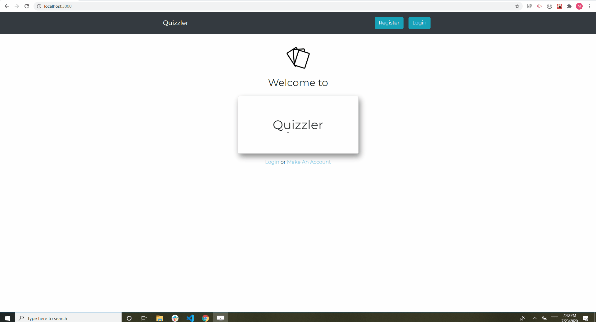

# Quizzler
###### Description
This app allows you to create decks of flash cards for studying a subject.  

[Click here to live link](https://quizzler-app.herokuapp.com/)

## Contributors
* jeffreymcfarland
* PBridwell
* mwturner611

## Technology
MongoDB, Mongoose, Node.JS, Express, Heroku, React, React Router, Reactstrap, Bcrypt, Jsx, JavaScript, HTML, CSS and Axios 

## Table of Contents
* [Top of Page](#description)
* [Technologies Used](#technologies)
* [Usage](#usage)
* [License](#license)
* [Contributing](#contributing)
* [Contacts](#contacts)

## Demo

## Usage 
1. Register as a user or login
2. On the home page manage view/delete existing flash card decks or create new decks
3. For a selected deck go to the review card page OR edit/add cards page
4. On the Edit/Add cards page create new flash cards with a KeyWord and Definition
5. From the review cards page study your cards

## License
This project is licensed under The MIT License (MIT).

## Contributing Guidelines
All contributions and suggestions are welcome! For direct contributions, please fork the repository and file a pull request.

## Contacts
* Name: Jeff McFarland (@jeffreymcfarland)
* e-mail: jlmcfarlandj@gmail.com
* LinkedIn: https://www.linkedin.com/in/jlmmcfarlandj/

* Name: Patrick Bridwell (@PBridwell)
* e-mail: patbridwell@cox.net
* LinkedIn: https://www.linkedin.com/mwlite/in/patrick-bridwell-0a7451133

* Name: Matt Turner (@mwturner611)
* e-mail: mwturner611@gmail.com
* LinkedIn: https://www.linkedin.com/in/matt-turner-ba328211a/*# quizzler